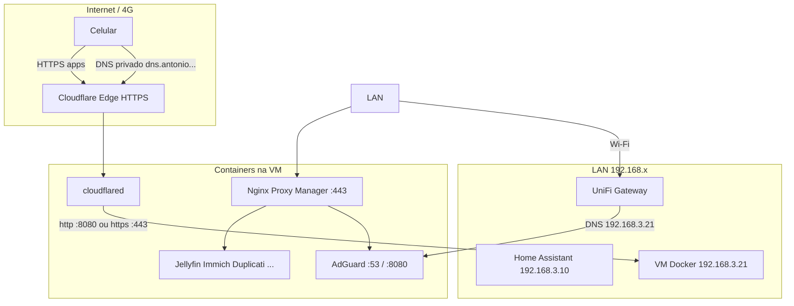

# Servidor homelab — guia completo para replicar

Documentação do ambiente **produção** em `192.168.3.21` (VM Docker no Proxmox). Objetivo: outra pessoa (ou você no futuro) conseguir **recriar** VM, serviços, DNS, HTTPS e backups sem depender de memória.

**Última revisão:** 2026-05-25  
**Domínio:** `antonio.rafael.nom.br`

---

## 1. Visão geral da arquitetura



| Camada | Função |
|--------|--------|
| **Proxmox** | Hypervisor `192.168.3.20` |
| **VM `docker`** | Debian 12, 8 GB RAM, IP `192.168.3.21/26` |
| **AdGuard** | DNS LAN + bloqueio; split DNS para `*.antonio.rafael.nom.br` |
| **NPM** | Termina HTTPS na LAN (`*.antonio.rafael.nom.br`) |
| **Cloudflare Tunnel** | Expõe serviços na internet **sem** abrir portas no router |
| **Duplicati** | Backup local para SSD `sdb` |
| **Portainer** | Gestão de stacks (composes “live” em volume) |
| **WUD** | Avisos de atualização de imagens → MQTT → HA |

---

## 2. Criar a VM e o sistema base

### 2.1 Proxmox

1. Nova VM: Debian 12 (netinstall ou template).
2. **RAM:** 8 GB (mínimo recomendado com Immich + Jellyfin).
3. **Disco 1:** SO (ex. 32–64 GB).
4. **Disco 2 (opcional mas usado):** SSD montado em `/mnt/ssd-backup` para backups Duplicati.
5. **Rede:** bridge na VLAN principal; IP estático:

| Parâmetro | Valor |
|-----------|--------|
| IP | `192.168.3.21/26` |
| Gateway | `192.168.3.1` |
| DNS inicial | qualquer (depois será o próprio AdGuard) |

6. **Timezone:** `America/Sao_Paulo`.
7. **Swap:** activar se RAM limitada (ex. 2 GB).

### 2.2 Docker

```bash
apt update && apt install -y ca-certificates curl git sqlite3
install -m 0755 -d /etc/apt/keyrings
curl -fsSL https://download.docker.com/linux/debian/gpg -o /etc/apt/keyrings/docker.asc
echo "deb [arch=$(dpkg --print-architecture) signed-by=/etc/apt/keyrings/docker.asc] \
  https://download.docker.com/linux/debian bookworm stable" > /etc/apt/sources.list.d/docker.list
apt update && apt install -y docker-ce docker-ce-cli containerd.io docker-compose-plugin
```

### 2.3 Ficheiros de sistema (do repositório)

```bash
git clone git@github.com:ARafaelSF/home-lab-nas.git /root/homelab
cd /root/homelab

cp etc/docker/daemon.json /etc/docker/
cp etc/docker/homelab-firewall.sh /etc/docker/
cp etc/docker/homelab-trusted-networks.conf /etc/docker/
chmod +x /etc/docker/homelab-firewall.sh
cp etc/network/if-up.d/route-lan68 /etc/network/if-up.d/
chmod +x /etc/network/if-up.d/route-lan68
```

**Firewall:** restringe portas de admin (Portainer, Duplicati, NPM admin, etc.) às VLANs em `homelab-trusted-networks.conf` (`192.168.3.0/24`, `192.168.68.0/24`).

```bash
/etc/docker/homelab-firewall.sh
# Persistir: @reboot no cron ou unit systemd
```

**Roteamento LAN 68.x:** ver `docs/roteamento-docker-lan.md` — evita perder SSH quando Docker cria bridges `192.168.x`.

### 2.4 Pastas no host

| Caminho | Uso |
|---------|-----|
| `/media` | Biblioteca Jellyfin |
| `/mnt/ssd-backup` | Destino backups Duplicati |
| `/opt/duplicati-scripts` | Hooks pre/post backup (copiar de `homelab/scripts/duplicati-hooks/`) |
| `/root/homelab` | Este repositório |

---

## 3. Ordem de deploy dos serviços

Use `homelab/scripts/deploy-stack.sh <nome>` ou Portainer (stacks numerados em `portainer_data/compose/<id>/`).

| Ordem | Stack (`compose/`) | Portainer ID (ref.) | Notas |
|-------|-------------------|---------------------|--------|
| 1 | `adguard-home` | — | DNS antes de tudo |
| 2 | `nginx-proxy-manager` | — | Projeto Docker `npm` |
| 3 | `cloudflare-tunnel` | 4 | Requer `.env` com `TUNNEL_TOKEN` |
| 4 | `homepage` | — | Dashboard LAN |
| 5 | `vaultwarden` | — | |
| 6 | `uptime-kuma` | — | Imagem `louislam/uptime-kuma:2` |
| 7 | `immich` | 8 | `.env` com `DB_PASSWORD`, `PUBLIC_URL` |
| 8 | `jellyfin` | — | Volume `/media` |
| 9 | `mealie` | — | `ALLOW_SIGNUP=false` após criar contas |
| 10 | `duplicati` | 25 | Volume config `25_duplicati_config` |
| 11 | `wud` | 26 | MQTT → HA |
| 12 | `portainer` | — | |
| 13 | `filebrowser` | — | Opcional; monta `/` |

**Segredos:** nunca no Git — ver `docs/SECRETS.md` e `*.env.example` por stack.

---

## 4. Nginx Proxy Manager (HTTPS na LAN)

- **Admin:** `http://192.168.3.21:81` (só VLANs confiáveis).
- **Certificado:** wildcard `*.antonio.rafael.nom.br` (Let's Encrypt).
- **Dados:** volume Docker `npm_npm_data`.

### Proxy hosts (referência 2026-05-25)

| ID | Domínio | Forward | Porta | SSL forçado |
|----|---------|---------|-------|-------------|
| 1 | `home-server-nas.antonio.rafael.nom.br` | 192.168.3.21 | 3001 | não |
| 2 | `senhas.antonio.rafael.nom.br` | 192.168.3.21 | 3003 | não |
| 3 | `adguard.antonio.rafael.nom.br` | 192.168.3.21 | 8080 | não |
| 4 | `fotos.antonio.rafael.nom.br` | 192.168.3.21 | 2283 | não |
| 5 | `jellyfin.antonio.rafael.nom.br` | 192.168.3.21 | 8096 | não |
| 6 | `portainer.antonio.rafael.nom.br` | 192.168.3.21 | 9443 | não |
| 7 | `receitas.antonio.rafael.nom.br` | 192.168.3.21 | 9925 | não |
| 8 | `uptimekuma.antonio.rafael.nom.br` | 192.168.3.21 | 3002 | não |
| 9 | `nginx.antonio.rafael.nom.br` | 192.168.3.21 | 81 | não |
| 10 | `filebrowser.antonio.rafael.nom.br` | 192.168.3.21 | 8085 | não |
| 11 | `homeassistant.antonio.rafael.nom.br` | **192.168.3.10** | 8123 | não |
| 12 | `duplicati.antonio.rafael.nom.br` | 192.168.3.21 | 8200 | não |
| 13 | `dns.antonio.rafael.nom.br` | 192.168.3.21 | 8080 | **sim** |

Export JSON: `backups/npm-proxy-hosts-referencia.json`.

**Replicar:** criar cada host na UI NPM; para `dns`, activar SSL e websockets. Se o ficheiro `data/nginx/proxy_host/13.conf` não for gerado, recriar o host na UI ou reiniciar NPM.

---

## 5. Cloudflare Tunnel

- **Container:** `cloudflared`, token em `compose/4/.env` → `TUNNEL_TOKEN`.
- **Painel:** Zero Trust → Networks → Tunnels → Public Hostnames.

### Rotas DNS / AdGuard (opção B — 4G)

| Hostname público | Serviço | URL no túnel | TLS extra |
|----------------|---------|--------------|-----------|
| `adguard.antonio.rafael.nom.br` | UI admin (Access opcional) | `http://192.168.3.21:8080` | — |
| `dns.antonio.rafael.nom.br` | DoH `/dns-query` (sem Access) | **`http://192.168.3.21:8080`** | — |

O telemóvel usa **HTTPS até à Cloudflare**. Por dentro, `adguard` e `dns` devem ir em **HTTP** para `:8080` (AdGuard DoH).

> **Não** usar `https://192.168.3.21:443` no túnel para `dns`: o cloudflared não envia SNI com o hostname; o NPM devolve `tls: unrecognized name` → Intra/DNS privado **falha no 4G** mas pode parecer OK no Wi‑Fi (liga directo a `192.168.3.21` com SNI correcto).

Outros serviços (Jellyfin, Portainer, …) seguem o padrão já existente no túnel (`https://192.168.3.21:443` + noTLSVerify).

---

## 6. AdGuard Home

### Portas

| Porta host | Uso |
|------------|-----|
| 53/tcp,udp | DNS plain (LAN) |
| 8080 | UI HTTP + **DoH** `/dns-query` |
| 3000 | Setup inicial (pode fechar depois) |

### Painel «Criptografia» — deixar DESLIGADO

Com túnel Cloudflare + NPM **não** activar «Ativar criptografia» no AdGuard:

- Certificado HTTPS fica na **Cloudflare** (público) e no **NPM** (interno).
- AdGuard serve DoH em `:8080` com `http.doh.insecure_enabled: true` (YAML). Sem isto, `/dns-query` responde **404** atrás do túnel HTTP.

### Split DNS (LAN vs 4G)

**Problema:** rewrite global `*.antonio.rafael.nom.br` → `192.168.3.21` quebra domínios no 4G (IP privado).

**Solução implementada:**

1. Rewrites globais em `filtering.rewrites` → **disabled**.
2. Regras em `user_rules` com modificador `$client=192.168.0.0/16`:

```text
||antonio.rafael.nom.br^$client=192.168.0.0/16,dnsrewrite=NOERROR;A;192.168.3.21
||.antonio.rafael.nom.br^$client=192.168.0.0/16,dnsrewrite=NOERROR;A;192.168.3.21
```

3. Regras: `config/adguard/split-dns-user-rules.example.txt`
4. DoH/TLS: `config/adguard/AdGuardHome.http-doh.example.yaml` (`http.doh.insecure_enabled: true`, `tls.enabled: false`)
5. `trusted_proxies`: `172.16.0.0/12`, `192.168.0.0/16`

**Config live:** volume `adguard-home_adguard_conf` → `AdGuardHome.yaml` (não commitar se tiver dados sensíveis).

### DNS no celular (4G)

- Android: **DNS privado** → `dns.antonio.rafael.nom.br`
- iPhone / Intra: URL `https://dns.antonio.rafael.nom.br/dns-query`

**Teste:** `homelab/scripts/testar-dns-remoto.sh` no servidor; no 4G abrir Jellyfin e ver consultas em `adguard.antonio...`.

Documentação detalhada: `docs/ADGUARD-DNS-REMOTO.md`.

### Router / UniFi

Apontar DNS da rede para `192.168.3.21` (ou DHCP option 6).

---

## 7. Duplicati

Estratégia **3-2-1** (detalhe e FAQ): `docs/DUPLICATI-ONEDRIVE.md`.

| Job | Quando | Destino | Retenção |
|-----|--------|---------|----------|
| `docker-local` | Diário 02:00 | SSD `proxmox-docker01` | `1W:1D,4W:1W,12M:1M` |
| `homelab-onedrive` | Terça 04:00 | OneDrive `/Homelab-Backup` | `4W:1W,12M:1M` |

A nuvem copia **só a pasta do SSD** (não relê `/media` nem volumes outra vez).

| Item | Valor |
|------|--------|
| UI LAN | `http://192.168.3.21:8200` |
| UI HTTPS | `https://duplicati.antonio.rafael.nom.br` (WebSockets no NPM) |
| Config volume | `25_duplicati_config` |
| Estado | `scripts/duplicati-status.sh` |
| Senha UI = passphrase | `docs/DUPLICATI-BACKUP.md` |

Hooks param containers antes do backup — scripts em `scripts/duplicati-hooks/`.

---

## 8. Home Assistant (VM separada)

| Item | Valor |
|------|--------|
| IP | `192.168.3.10` |
| URL NPM | `https://homeassistant.antonio.rafael.nom.br` |
| Uptime Kuma webhook | `http://192.168.3.10:8123/api/webhook/uptime_kuma_homelab` |
| WUD | entidades `update.sistema_docker_*` via MQTT |
| MCP | `docs/MCP-HOME-ASSISTANT-GUIA.md` |

---

## 9. UniFi / rede

| Rede | CIDR | Notas |
|------|------|--------|
| Principal (VM) | `192.168.3.0/24` | VM `.21`, HA `.10`, Proxmox `.20` |
| Vlan_Hangar (PCs) | `192.168.68.0/24` | Firewall homelab permite |
| IoT | (documentar em `PENDENCIAS.md`) | **Não** pôr em `homelab-trusted-networks.conf` |

---

## 10. Checklist de replicação

- [ ] VM Debian + Docker + ficheiros `etc/`
- [ ] SSD `/mnt/ssd-backup` + `/media`
- [ ] Stacks na ordem da secção 3
- [ ] `.env` por stack (Cloudflare, Duplicati, WUD, Immich)
- [ ] AdGuard: upstream DNS + regras split DNS
- [ ] NPM: 13 proxy hosts + certificado wildcard
- [ ] Cloudflare: túnel + hostnames (incl. `dns`, `adguard`)
- [ ] Router: DNS → `192.168.3.21`
- [ ] Duplicati: job `docker-local` + hooks em `/opt/duplicati-scripts/`
- [ ] Uptime Kuma: monitores HTTPS + webhook HA
- [ ] Teste 4G: DNS privado `dns.antonio.rafael.nom.br`
- [ ] Vaultwarden: guardar segredos; activar 2FA
- [ ] `git push` do repositório homelab

---

## 11. Manutenção e documentos relacionados

| Documento | Conteúdo |
|-----------|----------|
| `README.md` | Resumo e links |
| `PENDENCIAS.md` | Tarefas em aberto |
| `docs/DUPLICATI-BACKUP.md` | Backup e restore |
| `docs/ADGUARD-DNS-REMOTO.md` | DNS 4G / opção A vs B |
| `docs/SECRETS.md` | Onde ficam tokens |
| `docs/RECOMENDACOES.md` | Revisão Docker |
| `docs/PUSH-GITHUB.md` | Deploy key GitHub |

| Script | Uso |
|--------|-----|
| `scripts/deploy-stack.sh` | Subir stack |
| `scripts/testar-dns-remoto.sh` | Validar split DNS + túnel |
| `scripts/duplicati-verificar-backup.sh` | Tamanho backups |
| `scripts/duplicati-testar-senha.sh` | Validar passphrase |
